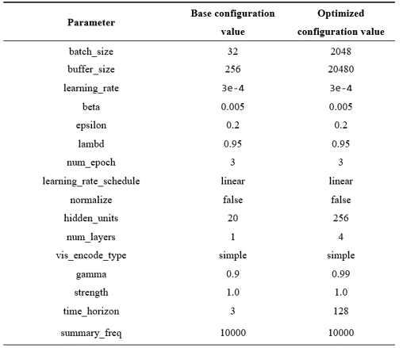
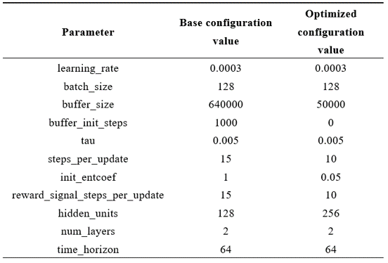

# ChickenEggs Unity Game
---
The project was created to explore the principles and capabilities of the Unity ML-Agents plugin, which is used for the integration of machine learning algorithms into a game.

---

## Project details
* The game involves controlling a chick that can move in six directions. When the chicken stays in the nest for a few seconds, then the egg will form in the nest. The goal of the game is to lay as many eggs as possible within a set amount of time.
* To achieve the goal, the PPO and SAC algorithms were tested. Conclusions were drawn regarding the effectiveness of each algorithm for this task. Optimal hyperparameter values were also selected for each algorithm.
* The game logic is contained within 5 C# scripts.

### Screenshots

  
  

### Project structure

  

### Conclusion
Using the PPO algorithm, a functional model was obtained after 26 minutes of training. The average reward was 21 eggs per training cycle (1 minute). The model's size is 830 KB. 
Hyperparameters:

  

The SAC algorithm used 80 minutes for training, resulting in a model with an average reward of 27. The model's size is 319 KB. Hyperparameters:

  

